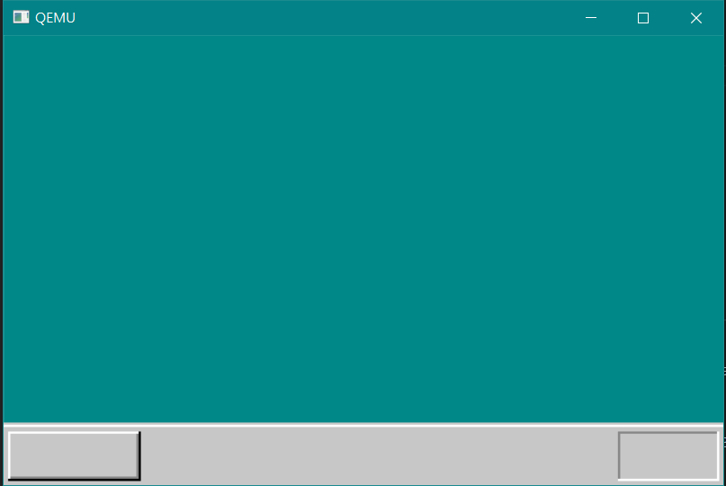

# day04

## 進度
透過將資料寫入 VRAM 視訊記憶體來控制畫面顏色。

在控制畫面顏色之前需要透過 device 的 io 來調整 VGA 的調色盤(palette)，
目的是為了設定 VRAM 中的 data 所對應到的顏色。

- 調色盤(palette)：
    - 透過指定顏色代碼(RGB) mapping 到顏色編號
    - 因為這邊使用 320x200 的 8 位元彩色模式，顏色編號只能使用 0 ~ 255
    - 0 ~ 255 的顏色編號由程式開發人員自行決定
        - 例如設定顏色編號25是 0xffffff，顏色編號26是#123456

- device 的 io 方式：
    1. 先將 interrupt flag 設為 0 (意思為暫時忽略 interrupt)
    2. 透過 device id 來輸出或寫入資料
    3. io 完成後將 interrupt flag 還原

執行 haribote.img 可看見畫面由幾個方形組成類似GUI的模樣(只是做個樣子，還沒有功能)。



## How to use
- compile
    ```bash
    make
    ```
- run
    ```bash
    make run
    ```
- clean
    ```bash
    make clean
    ```
- clean, only leave the source code
    ```bash
    make src_only
    ```